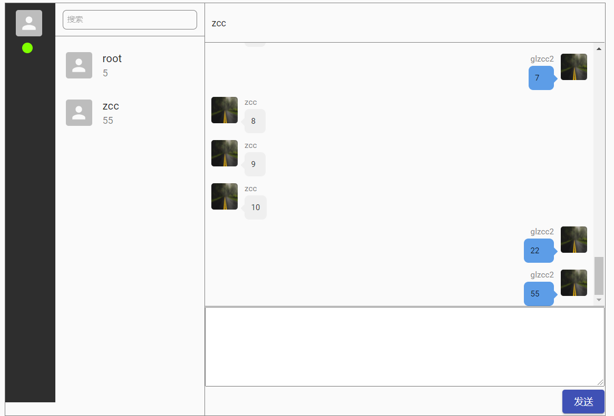

# Chat
Chat 一个简单的Web聊天程序，正在开发中 (基于 NextJS React TypeScript MongoDb socketIO )




## Getting Started

```bash
yarn

yarn dev

or

npm i

npm run dev

```
访问地址 [http://localhost:3333](http://localhost:3333)


## TODO
- [x] 好友互相聊天
- [x] 接入数据库
- [x] 选择UI
- [x] 注册、登录制作
- [x] 单对单聊天
- [ ] 建立群组
- [ ] 群发消息
- [ ] 解散群组
- [ ] 其他类型消息支持

